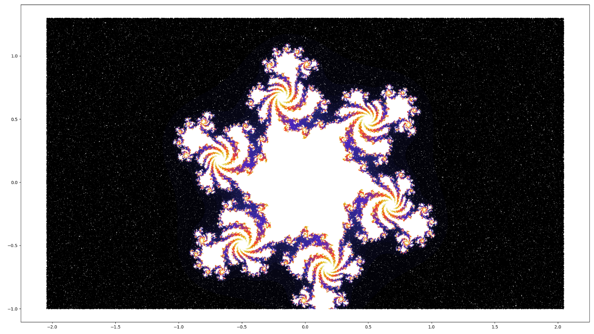

Nathan Flack

CPSC 455

Final Project

Complex Iterative Map

Consider the Julia set given in Figure (1). Take the mapping z~n~+1 =
z^2^~n~ + c where c = −0.5 + 0.3i

\(a\) Iterate the initial point z0 = 0 + 0i for 500 iterations and list
the final 100. Increase the number of iterations. What can you say about
the orbit?

Final 100 iterations after 500 iterations:

-0.38254595+0.16996282j

-0.38254595+0.16996282j

-0.38254595+0.16996282j

...

...

...

-0.38254595+0.16996282j

-0.38254595+0.16996282j

-0.38254595+0.16996282j

Final 100 iterations after 5000 iterations:

-0.38254595+0.16996282j

-0.38254595+0.16996282j

-0.38254595+0.16996282j

...

...

...

-0.38254595+0.16996282j

-0.38254595+0.16996282j

-0.38254595+0.16996282j

The orbit is attracted to the fixed point at -0.38254595+0.16996282j

\(b\) Iterate the initial point z0 = −1 − i and list z1 to z10. What can
you deduce about this orbit?

-1.0-1.0j,

 -0.5+2.3j,

 -5.54-2.0j,

 26.1916+22.46j,

 181.04831056+1176.826672j,

 -1352143.02517396+426125.26157509j,

 1.64670802e+12-1.1523646e+12j,

 1.38370314e+24-3.79521606e+24j,

 -1.24890306e+49-1.05029047e+49j,

 4.56648772e+97+2.62342198e+98j

This orbit increases to infinity as it iterates.

2\. Given c = −1 + 1, determine the fixed points of periods one and two.

2a. fixed points

z\^2 - 1 + 1i = z

z~1~= -0.693897202308099 + 0.418796525390441i

z~2~= 1.6938972023081 - 0.418796525390441i

2b. period two

(z\*\*2 - 1 + 1i)\*\*2 - 1 + 1i = z

Z~3~ = -1.30024259022012 + 0.624810533843827i,

Z~4~ = 0.30024259022012 - 0.624810533843827i,

3\. Plot the Julia sets for

\(a\) c = 0 + 0i,

\(b\) c = −0.5 + 0i,

\(c\) −0.7 + 0i,

\(d\) −2 + 0i.

4\. Compute the fixed points of period one for
$z_{n + 1} = 2 + \frac{ze^{i{|z|}^{2}}}{10}$

$$2 + \frac{ze^{i{|z|}^{2}}}{10} = z$$

Z=1.80619 - 0.0211285i

5\. Determine the boundaries of points of periods one and two for the
mapping $z_{n + 1} = c - \ z_{n}^{2}$

$$c - \ z_{n}^{2} = z$$

Period one:

$$z = \frac{1}{2}( \pm \sqrt{4c + 1} - 1)$$

Period two:

$$z = \frac{1}{2}( \pm \sqrt{4c - 3} + 1)$$

Additional plots: z~n~+1 = z^2^~n~ + c

$$z_{n + 1} = 2 + \frac{ze^{i{|z|}^{2}}}{10}$$

$$z_{n + 1} = c - z_{n}^{2}$$

z~n~+1 = z^2^~n~ + c

$$z_{n + 1} = z_{n}^{3} + c$$

$$z_{n + 1} = z_{n}^{4} + c$$

$$z_{n + 1} = z_{n}^{3} + c$$

$$z_{n + 1} = z_{n}^{6} + c$$

$z_{n + 1} = \frac{1 - \frac{z_{n}^{3}}{6}}{{{(z}_{n -}\frac{z_{n}^{2}}{2})}^{2}}$

$z_{n + 1} = 1 - z_{n}^{2} + \frac{z_{n}^{5}}{2 + 4z_{n}}$ + c

$$z_{n + 1} = 1 - z_{n}^{3} + \frac{z_{n}^{6}}{2 + 4z_{n}} + 0.7885\ e^{ia}\ \text{for\ 0} < a\  < 2\pi$$

## plot_julia_set

This is an example of the graph created by plot_julia_set